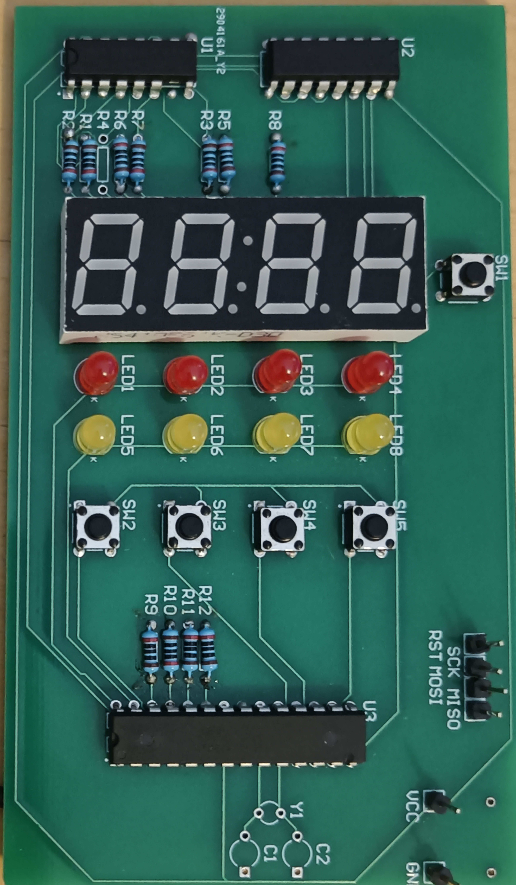
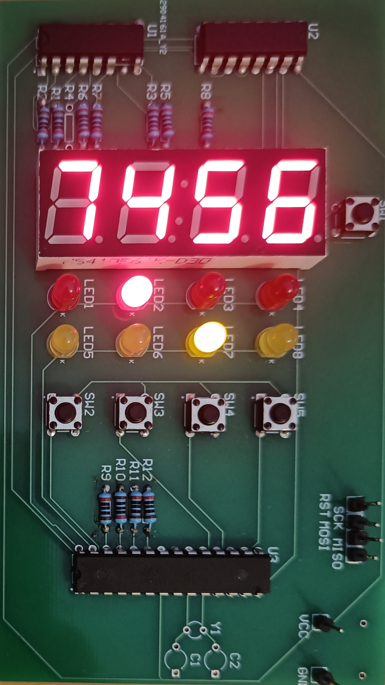

# Guess the number
A simple game, that is about guessing a random number.
There may be multiple number of tries to guess the number.
The goal is to guess it in as low number of tries as possible.

Each turn, the user may enter a number and compare it to the generated number.
There is red and yellow LED for each digit. After comparison, yellow LED
will light up if the digit on the associated position is present in the number,
but is on different position. The red LED will light up if the digit
is correct and on the correct position.

The game contains simple animations played
on the start as well as after successfully
guessing the number.

## Photo of the final project

## Structure of the repository
The repository contains code of the firmware written in Rust
and the pcb project made in Altium Designer.
For better accessibility to the schematic and PCB,
a pdf with these has been added as well.
